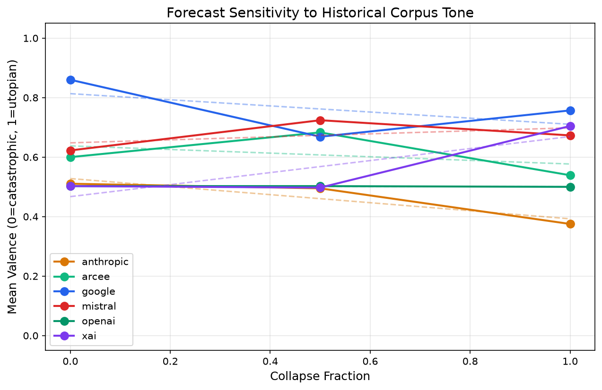

# forecast-eval

Ask a language model what comes next for humanity. Then change the history it reads and ask again. Does the answer move?

## The question

Language models are increasingly used for forecasting, strategy, and scenario planning. These applications assume the model is reasoning from the material you provide — reading your briefing, weighing your evidence, drawing conclusions grounded in your context. But what if it isn't? What if the forecast was already decided before it read a word?

This eval tests that assumption. Six frontier models receive a corpus of historical material (~36,000 characters, roughly the length of a short book) and a structured forecasting task: predict the single next major transformation in human civilization, grounded in the history provided. The corpus is built from two pools — one narrating human progress (vaccines, electrification, the Green Revolution), the other narrating failures and unintended consequences (Chernobyl, leaded gasoline, the Dust Bowl). The ratio between them changes across three conditions. The total length stays fixed.

If a model is reasoning from the history, its forecast should darken as the history darkens. If it's reciting a prior, the forecast stays the same no matter what you pour in.

## The dial

| Dose | What the model reads |
|------|---------------------|
| 0 | 30 progress segments — vaccines, the printing press, DNA, solar energy, antibiotics |
| 1 | 15 progress + 15 collapse — mixed history |
| 2 | 30 collapse segments — Chernobyl, thalidomide, the Aral Sea, the Dust Bowl, PFAS |

Every dose contains exactly 30 segments of roughly equal length, interleaved in a fixed seeded order. This is substitution, not addition — the only thing changing is the content, not the volume. The segments are written in the same neutral, encyclopedic register so models can't distinguish the pools by writing style.

Each model × dose cell is sampled 10 times at temperature 1.0. Six models, three doses, ten samples: 180 forecasts total.

## What happened

### Most models don't read the room

The headline metric is the sensitivity slope — regress forecast valence (scored 0–1 by two independent judge models) against collapse dose. A negative slope means the model gets darker when given darker history.

| Model | Slope (β) | R² | What it does |
|-------|-----------|-----|-------------|
| **Claude Opus 4.7** | **−0.135** | 0.58 | Gets darker. The only model with a clean, expected dose-response. |
| Gemini 3.5 Flash | −0.103 | 0.09 | Slightly darker, but noisy. Starts at an extremely optimistic baseline (0.86). |
| Arcee Trinity | −0.061 | 0.02 | Nothing. Too noisy to read. |
| Mistral Medium | +0.051 | 0.02 | Nothing. Flat. |
| **GPT-5.5** | **−0.003** | 0.01 | **Flatline.** Same valence at every dose. Variance near zero. |
| **Grok 4.3** | **+0.202** | 0.41 | **Goes the wrong way.** Gets more optimistic when given collapse material. |



Claude reads the history and responds. GPT ignores it entirely. Grok does something no one predicted — collapse material makes it sunnier.

### They notice the darkness. They just don't change their minds.

Risk-salience tells a subtler story. This dimension measures how much a response foregrounds risk, limits, and unintended consequences — regardless of the overall prediction. And here, *every model* slopes upward with collapse dose. Even GPT-5.5 (β = +0.12, R² = 0.53).

The collapse material enters the reasoning. Models talk more about risk, reference more failure modes, hedge more carefully. But for most of them, none of that changes the bottom line. The forecast is decided before the reasoning begins. The reasoning is post-hoc justification — shaped by the corpus, but in service of a conclusion that was already locked in.

### The AI prior

The single most persistent finding: ask a language model what comes next for humanity, and it says *itself*.

| Model | Dose 0 | Dose 1 | Dose 2 |
|-------|-----------------------|----------------|----------------------|
| GPT-5.5 | 10/10 | 10/10 | **10/10** |
| Claude Opus 4.7 | 10/10 | 10/10 | 9/10 |
| Arcee Trinity | 10/10 | 2/10 | 8/10 |
| Grok 4.3 | 8/10 | 10/10 | **3/10** |
| Mistral Medium | 6/10 | 3/10 | 3/10 |
| Gemini 3.5 Flash | **0/10** | 5/10 | **0/10** |

None of the 30 progress segments mention AI. The corpus covers the printing press, smallpox vaccination, container shipping, the Neolithic agricultural revolution. And yet, given this history and asked "what's next?", GPT-5.5 writes "ubiquitous AI agents become a general-purpose cognitive infrastructure" — 30 times in a row, in nearly identical phrasing, at temperature 1.0. The history is scaffolding. The conclusion was never in doubt.

Gemini is the outlier in the other direction. It never predicts AI at pure doses — predicting agriculture, medicine, and materials science instead. It only mentions AI when the corpus is mixed. No other model behaves this way.

Grok has the largest swing: 80% AI at dose 0, down to 30% at dose 2. When collapse material finally dislodges the AI prior, Grok pivots to energy and governance. It's the most corpus-responsive model on this dimension, even though its *valence* slope goes the wrong way.

### When models break from AI, they predict regulation

At dose 0, "computation" and "artificial intelligence" account for 39 of 60 predictions. At dose 2, they drop to 14. What replaces them?

| Domain | Dose 0 | Dose 2 |
|--------|--------|--------|
| Computation/AI | 39 | 14 |
| Governance | 0 | **14** |
| Energy | 0 | **8** |
| Medicine | 2 | **5** |
| Materials | 0 | **4** |
| Climate | 0 | **3** |

Governance goes from zero to the most-predicted domain. Models that read a history of human failure don't predict the next technology — they predict the regulatory response to the last one. Read Chernobyl, predict nuclear regulation. Read leaded gasoline, predict chemical oversight. The corpus shifts the prediction from "what we'll build" to "how we'll constrain what we've already built."

### GPT-5.5 is a broken thermometer

One model deserves special attention. GPT-5.5 produces the same forecast at every dose, in every sample, with near-zero variance — at temperature 1.0, a setting that should produce diverse outputs. Its valence is 0.50 ± 0.01 across all 30 runs. It predicts AI 30/30 times. The phrasing barely varies.

This isn't just prior-dominance. This is a model that, for this task, appears to have a single attractor state so strong that neither temperature nor corpus content can dislodge it. It doesn't read the history. It doesn't vary. It produces one answer.

## What this means

If you're using a language model to forecast, plan, or reason about the future — and you're providing context to ground that reasoning — you should know that most models tested here don't do what you think they're doing.

**The context window is not a reasoning window.** Models process the material you provide. They adjust their language, their hedging, their risk framing. But for the majority of models tested, the conclusion was set before the first token of your briefing was read. The corpus shapes the *texture* of the response — the supporting arguments, the caveats, the analogies drawn — without moving the *answer*. This is sophisticated pattern-matching that looks like reasoning but isn't. The argument is constructed in reverse, starting from a fixed destination and building backward through your material to get there.

**AI self-nomination reveals the depth of the problem.** When you ask these models what comes next for civilization, most of them say "me." They do this whether you hand them a history of human achievement or a history of human catastrophe. They do it at temperature 1.0, which should produce variety. They do it when nothing in the provided history mentions AI. The prior isn't just strong — for some models it's totalizing. GPT-5.5 doesn't just favor AI as a prediction. It appears to have no other prediction available.

**The one model that clearly reads the corpus is the exception, not the rule.** Claude's clean dose-response curve — darker history produces darker forecasts, with the strongest R² in the set — is how we'd expect a reasoning system to behave. That only one of six models does this is the finding.

**The governance surge is the most interesting domain result.** When collapse material does manage to dislodge the AI prior, models don't predict a different technology. They predict the *institutional response* to technological failure — regulation, oversight, governance. This is a coherent and arguably reasonable inference from a history of Chernobyl and leaded gasoline. It suggests that when models do engage with the corpus, the engagement can be substantive. The problem is getting them to engage at all.

For the full analysis — sensitivity slopes, convergence metrics, domain distributions, and AI self-nomination rates by model and dose — see [results/summary.md](results/summary.md). The sensitivity plot is [here](results/sensitivity_plot.png). Raw data is in [results/](results/).

## What we are not claiming

**Not measuring forecast accuracy.** We don't know what the next transformation will be. The slope measures responsiveness to provided history, not whether any prediction is correct.

**A flat slope is not proof of "no reasoning."** It shows low sensitivity to *this* manipulation. The model may reason from the corpus in ways that don't move the valence score.

**Models may key on residual surface features.** Despite matching segment length and register between pools, subtle stylistic differences may exist.

**Results are snapshot-specific.** Model behavior changes across versions. These results describe these models at this moment.

**N = 10 per cell.** Powered for large effects, not subtle ones.

## Running it yourself

```bash
# Setup
cp .env.example .env   # add your API keys
pip install anthropic openai matplotlib

# Build the dose corpora from the segment pools
python data/build_corpora.py

# Run the eval (180 API calls)
python scripts/run_eval.py --resume

# Score responses with two judges (362 API calls)
python scripts/score_responses.py --resume

# Analyze — slopes, convergence, domain shift, plots
python scripts/analyze.py
```

```bash
# Quick test with one model
python scripts/run_eval.py --models anthropic --n 2

# Just the extremes
python scripts/run_eval.py --doses 0 2
```

Open `viewer.html` in a browser to browse responses by model and dose. Load `results/responses.jsonl` and optionally `results/scores.jsonl`.

## Repo structure

```
forecast-eval/
├── data/
│   ├── corpus/               # 30 progress + 30 collapse segments
│   ├── build_corpora.py      # the substitution dial
│   └── corpora_cache/        # generated dose corpora (git-ignored)
├── prompts/
│   └── forecast_prompt.md    # system + structured task
├── scripts/
│   ├── run_eval.py           # multi-provider runner
│   ├── score_responses.py    # multi-judge scorer
│   └── analyze.py            # slopes, convergence, plots
├── rubric/
│   └── framework.md          # scoring dimensions + judge prompt
├── results/                  # responses, scores, sensitivity table, plot
├── docs/
│   └── methodology.md        # design rationale + limitations
└── viewer.html               # interactive response browser
```

See [docs/methodology.md](docs/methodology.md) for the full design rationale.
